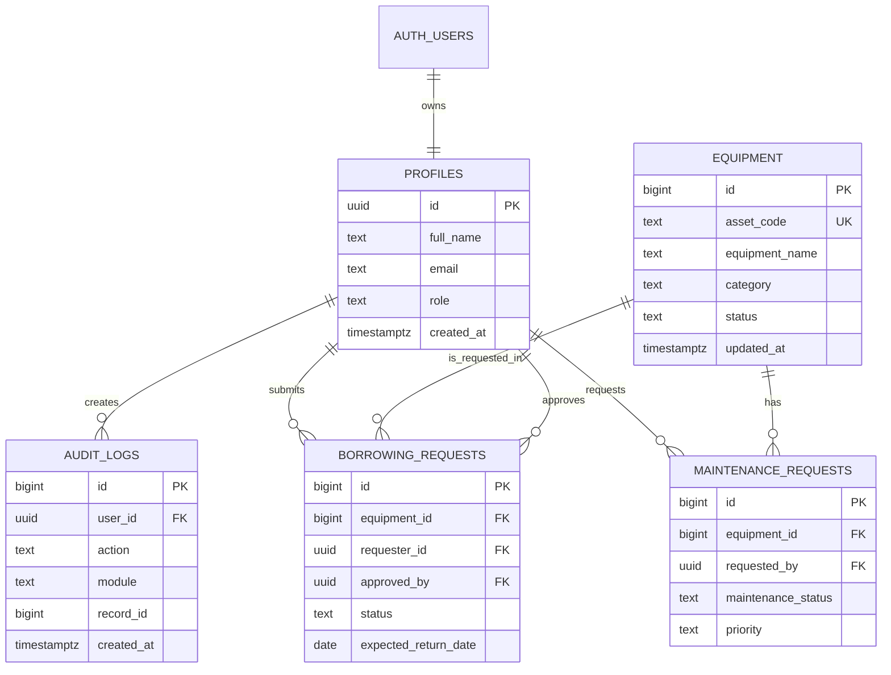
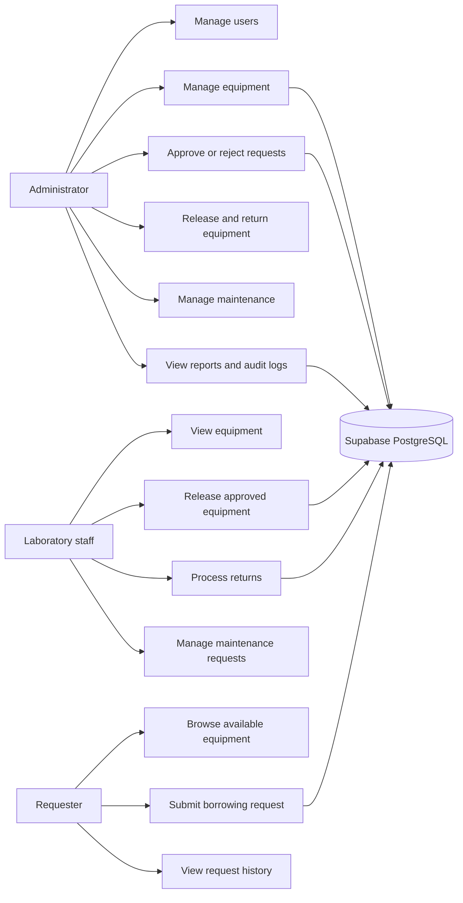
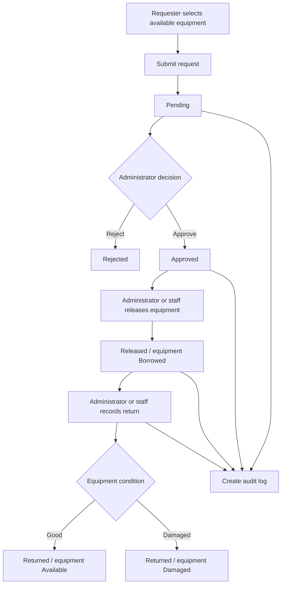
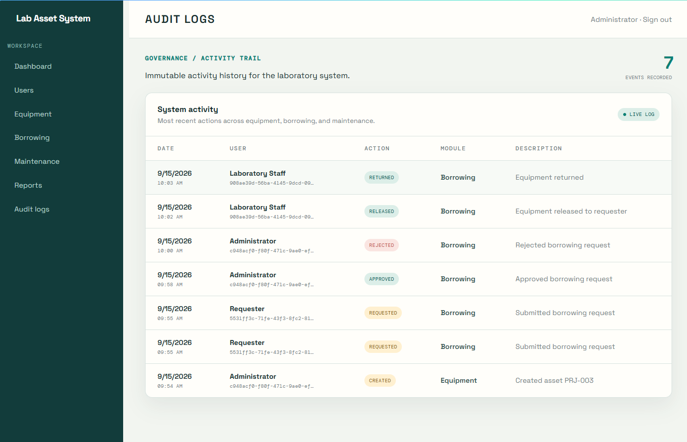

# Laboratory Asset System

A static HTML/CSS/JavaScript starter for managing laboratory equipment, borrowing, returns, maintenance, and audit activity.

## Run locally

Open `index.html` in a browser, or serve the folder with any static web server. The frontend uses Supabase Authentication and PostgreSQL when configured; without credentials it remains in its safe, unconfigured state.

## Structure

- `admin/`: administrator views for users, inventory, borrowing, maintenance, reporting, and audit logs.
- `staff/`: day-to-day equipment circulation and maintenance views.
- `requester/`: equipment discovery, requests, and request history.
- `css/`: shared, login, and dashboard styles.
- `js/`: authentication, route guard, dashboard, and feature-module placeholders.

## Supabase database setup

1. Create a Supabase project and open **SQL Editor**.
2. Run the complete script in [database/schema.sql](database/schema.sql).
3. In Supabase Authentication, create the first user.
4. Promote that account by running the commented `update public.profiles` statement at the bottom of the schema file.
5. Copy the project URL and publishable anon key into [js/supabase.js](js/supabase.js).

The schema creates profiles, equipment, borrowing requests, maintenance requests, and audit logs. It also enables Row Level Security, role helper functions, automatic profile creation for new Auth users, timestamp triggers, indexes, and sample equipment.

The schema starts with `drop table ... cascade` statements because it is designed for a new project. Remove those reset statements before running it against a database that already contains data.

## 4. Role-Permission Matrix

| Permission | Administrator | Laboratory staff | Requester / viewer |
|---|:---:|:---:|:---:|
| View available equipment | Yes | Yes | Yes |
| Add or delete equipment | Yes | No | No |
| Submit borrowing request | Yes | Yes | Yes |
| Approve or reject requests | Yes | No | No |
| Release approved equipment | Yes | Yes | No |
| Process equipment returns | Yes | Yes | No |
| Create maintenance request | Yes | Yes | No |
| Complete maintenance request | Yes | Yes | No |
| View request history | Yes | Yes | Own requests |
| View audit logs | Yes | No | No |
| Manage user profiles | Yes | No | No |

\* The interface permits request creation for authenticated users, while the database requires `requester_id = auth.uid()`.

## 5. Updated ERD



## 6. Use Case Diagram



## 7. Workflow Diagram



## 8. Business Rules

1. Only authenticated users with a matching `profiles` record may access protected pages.
2. Roles are limited to `administrator`, `laboratory_staff`, and `requester`.
3. Only equipment with status `Available` may be requested.
4. New borrowing requests always start with status `Pending`.
5. Only an administrator may approve or reject a borrowing request.
6. An administrator may not approve their own borrowing request.
7. Only requests with status `Approved` may move to `Released`.
8. Releasing equipment changes its equipment status to `Borrowed`.
9. Only requests with status `Released` may be returned.
10. A normal return changes equipment status to `Available`; a damaged return changes it to `Damaged`.
11. Maintenance statuses are `Pending`, `In Progress`, `Completed`, or `Cancelled`.
12. Audit records identify the acting user, action, module, record, description, and timestamp.
13. Row Level Security is the final authorization layer; client-side role checks are not a substitute for RLS.

## 9. Audit-Log Screenshot



Open the page after signing in as an administrator and capture the rendered **System activity** table. The page displays the event date, user, action, module, description, event count, and live-log status. The underlying implementation is in [admin/audit-logs.html](admin/audit-logs.html), [js/audit.js](js/audit.js), and [css/audit.css](css/audit.css).

## 10. Functional Test Results

| Test | Expected result | Result |
|---|---|---|
| Open `index.html` | Redirects to login | Passed |
| Open login page | Supabase login form renders | Passed |
| Open admin, staff, and requester routes | Routes return HTTP 200 | Passed |
| Load JavaScript files | No Node syntax errors | Passed |
| Requester equipment view | Available equipment is queried from Supabase | Implemented; requires authenticated Supabase data |
| Submit borrowing request | Request is inserted as `Pending` | Implemented; requires authenticated Supabase data |
| Approve or reject request | Administrator action updates request and creates audit entry | Implemented; requires administrator profile and RLS |
| Release equipment | Approved request becomes `Released`; equipment becomes `Borrowed` | Implemented; requires staff/admin profile and RLS |
| Return equipment | Request becomes `Returned`; equipment becomes `Available` or `Damaged` | Implemented; requires staff/admin profile and RLS |
| Maintenance workflow | Create and complete maintenance records | Implemented; requires staff/admin profile and RLS |
| Audit-log page | Administrator sees audit events | Implemented; requires administrator profile and RLS |
| Route structure check | No duplicate HTML documents or missing primary routes | Passed |

Local validation commands used:

```powershell
node --check js/*.js
npx prettier --check "**/*.{html,css,js}"
```

The final Supabase transaction tests must be run in the configured project after executing [database/schema.sql](database/schema.sql), creating Auth users, and assigning profile roles.
